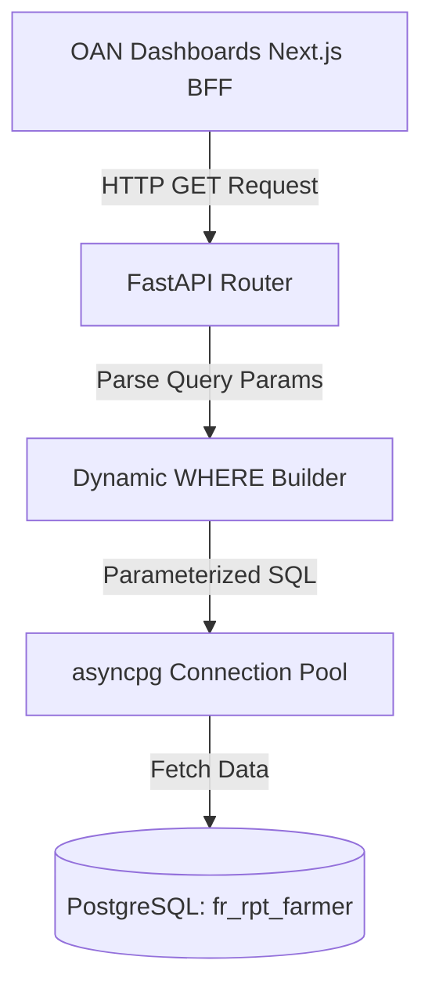

# Farmer Registry Dashboard API

This is a Python FastAPI microservice that serves as the Data Layer for the Farmer Registry Dashboards.

## Architecture

The API connects directly to the `farmer_registry_db` PostgreSQL database and queries the `fr_rpt_farmer` materialized view.



### Endpoints
All endpoints reside under `/api/v1/charts/` and support optional query parameters: `region`, `zone`, `woreda`, `kebele`, `farmingType`, and `recordState`.

- `/farmerKpis`: Aggregated totals, gender splits, and land size.
- `/farmersByRegion`, `/farmersByGender`, `/farmersByType`, `/farmersByAgeAndGender`, `/farmersByEducation`: Demographic distributions.
- `/landTenureSplit`: Parcel sizes grouped by ownership.
- `/registryTrendByMonth`: Timeseries data based on `registration_date`.
- `/registryCoverage`: Count of distinct Woredas covered.

## Security
- **CORS Configuration**: The API strictly allows origins defined in the `ALLOWED_ORIGINS` environment variable (defaults to `http://localhost:3000`).
- **SQL Injection Prevention**: The application heavily utilizes `asyncpg` parameterized queries (`$1`, `$2`) to safely inject filter variables into the SQL strings. No direct string interpolation is performed on user inputs.

## Development
To run this microservice locally (inside the `farmer-registry-coss-v3` network):
```bash
docker-compose build farmer-registry-dashboard-api
docker-compose up -d farmer-registry-dashboard-api
```
